# 1. 活动

[funpack第一期](https://www.eetree.cn/page/digikey-funpack)


任务：采集画面给LLM输出描述。


# 2. 资料

- [硬禾-Sipeed M1w Dock Suit K210 开发板](https://www.eetree.cn/project/detail/3618)

- 芯片：K210 [嘉楠官网K210](https://developer.canaan-creative.com/proDetail/210)，参数：
	
	
- 模块：[Sipeed M1/M1W](https://wiki.sipeed.com/hardware/zh/maix/core_module.html)

- 开发板：[MAIX Dock](https://wiki.sipeed.com/hardware/zh/maix/maixpy_develop_kit_board/Maix_dock.html)
	

参数：

外观：
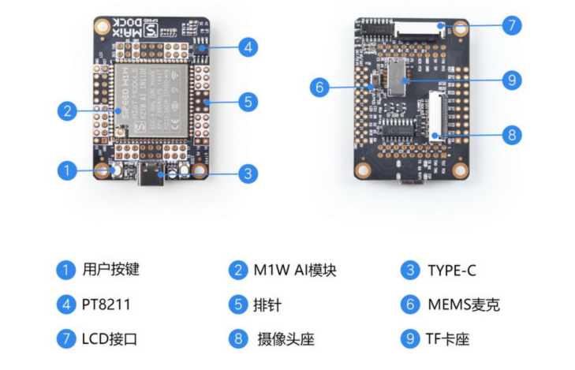


- [MAIXPY 文档](https://wiki.sipeed.com/maixpy/)

  

  maix dock属于maix-1系列，所以去看老文档

  [MaixPy-v1](https://wiki.sipeed.com/soft/maixpy/zh/)

- [K210 上手（避坑）指南](https://wiki.sipeed.com/news/MaixPy/K210_usage.html)

- IDE: [CanMV IDE](https://www.canaan-creative.com/developer)，[CanMV 文档](https://developer.canaan-creative.com/canmv/main/canmv/index.html)，有一些例程可以直接用

- IDE: [MaixPy IDE 安装与使用](https://wiki.sipeed.com/soft/maixpy/zh/get_started/env_maixpyide.html), 下载地址 [MaixPy IDE](https://dl.sipeed.com/MAIX/MaixPy/ide/) 报接口错误，去百度盘下载的

  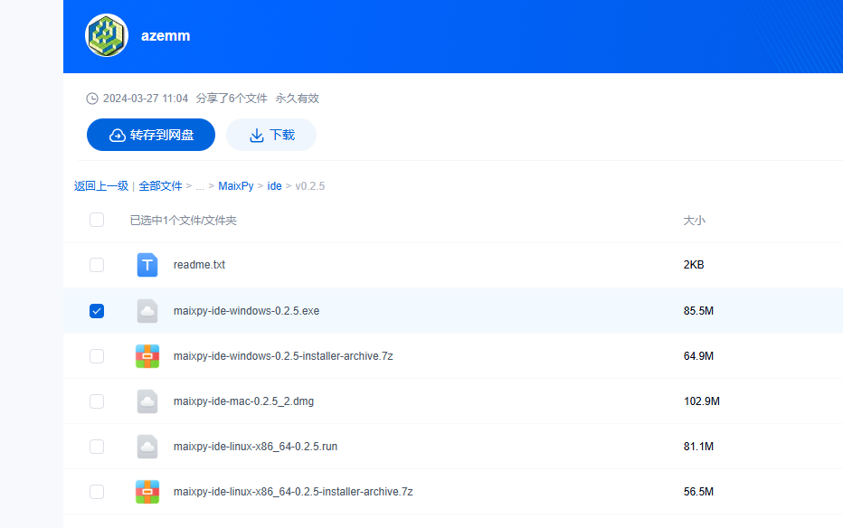

  两个ide其实差不多，canmv还能多一些例程，MaixPy可以选择开发板，所以还是用canmv吧

  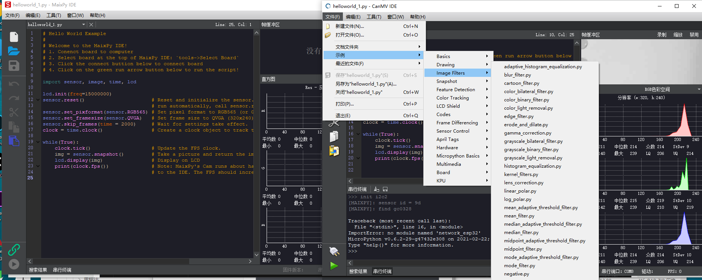
### 原理图和pdf 文档

- K210 Datasheet   `doc/kendryte_K210_datasheet_20180919020633.pdf`

- K210 电路图    `doc/M1w V1.11(schematic).pdf`

- K210 技术规格书  `doc/Sipeed Maix-Dock 规格书 V1.0.pdf`

- Sipeed Maix 电路图
 


# 3. 烧录固件

[更新 MaixPy 固件](https://wiki.sipeed.com/soft/maixpy/zh/get_started/upgrade_maixpy_firmware.html)


当前版本是0.6.2，对于maix1来说足够新了，不用更新。直接用


# 4. 使用

## 1. 初次使用

连接串口（115200），复位后能收到消息：

```
init end

[15:23:54.562]收←◆
 __  __              _____  __   __  _____   __     __
|  \/  |     /\     |_   _| \ \ / / |  __ \  \ \   / /
| \  / |    /  \      | |    \ V /  | |__) |  \ \_/ /
| |\/| |   / /\ \     | |     > <   |  ___/    \   /
| |  | |  / ____ \   _| |_   / . \  | |         | |
|_|  |_| /_/    \_\ |_____| /_/ \_\ |_|         |_|

Official Site : https://www.sipeed.com
Wiki          : https://maixpy.sipeed.com


[15:23:54.954]收←◆MicroPython v0.6.2-29-g47432e308 on 2021-02-22; Sipeed_M1 with kendryte-k210
Type "help()" for more information.
>>> 
```


这时候终端是一个python环境，可以运行命令

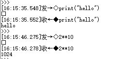


可以进行一些简单测试。

## 2. 编辑执行、上传文件到开发板

如果要编辑执行、上传、默认运行脚本可以参考下面链接：

[编辑并执行文件](https://wiki.sipeed.com/soft/maixpy/zh/get_started/get_started_edit_file.html)，[上传脚本&模块到开发板](https://wiki.sipeed.com/soft/maixpy/zh/get_started/get_started_upload_script.html)，[开机自启动脚本](https://wiki.sipeed.com/soft/maixpy/zh/get_started/get_started_boot.html)。使用MaixPyIDE/CANMV IDE 可以完成这些操作

- 编辑执行文件

  使用ide，可以创建编辑执行文件

  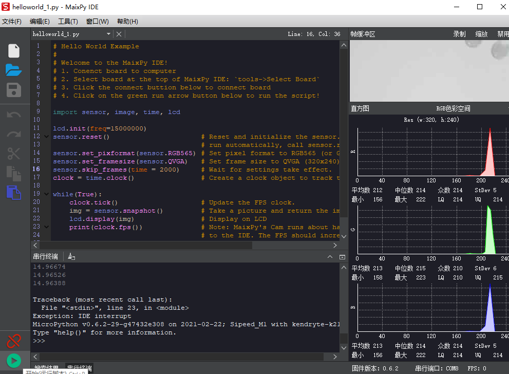

- 上传代码文件到开发板

  ​	ide工具命令下可以上传文件，如果保存到boot.py则自动运行

  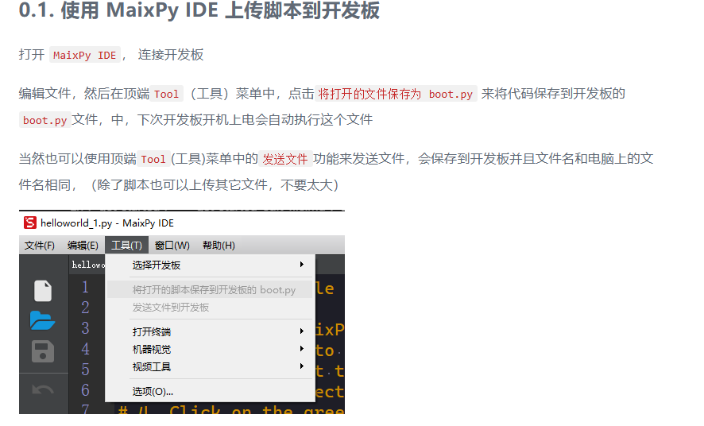

- 开机自运行

  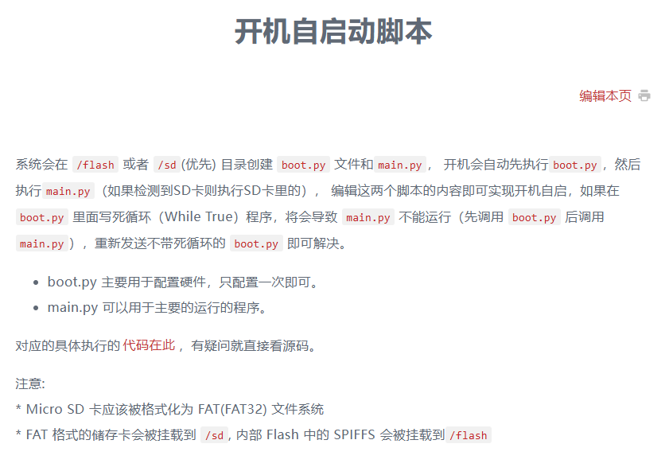


## 3. 点灯

想[点亮LED](https://wiki.sipeed.com/soft/maixpy/zh/get_started/get_started_led_blink.html)，用下面的映射不行，其实不应该不行啊，用的引脚

```python
from fpioa_manager import fm
from Maix import GPIO

io_led_g = 12
fm.register(io_led_g, fm.fpioa.GPIO0)
io_led_r = 13
fm.register(io_led_r, fm.fpioa.GPIO1)
io_led_b = 14
fm.register(io_led_b, fm.fpioa.GPIO2)

led_g=GPIO(GPIO.GPIO0, GPIO.OUT)
led_r=GPIO(GPIO.GPIO1, GPIO.OUT)
led_b=GPIO(GPIO.GPIO2, GPIO.OUT)
led_g.value(1)
led_r.value(1)
led_b.value(0)
```

发现需要[配置引脚](https://wiki.sipeed.com/soft/maixpy/zh/api_reference/builtin_py/board_info.html)，config_maix_dock.py 里面的引脚和原理图不符合，而且写文件放到了异常中

原理图引脚：G12 R13 B14

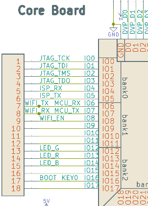 


**配置引脚**

```
import json

config = {
  "type": "dock",
  "board_info": {
      'BOOT_KEY': 16,
      'LED_R': 14,
      'LED_G': 13,
      'LED_B': 12,
      'WIFI_TX': 6,
      'WIFI_RX': 7,
      'WIFI_EN': 8,
      'MIC0_WS': 30,
      'MIC0_DATA': 20,
      'MIC0_BCK': 32,
      'I2S_WS': 33,
      'I2S_DA': 34,
      'I2S_BCK': 35,
  }
}

cfg = json.dumps(config)
print(cfg)

try:
  with open('/flash/config.json', 'rb') as f:
    tmp = json.loads(f.read())
    print(tmp)
    if tmp["type"] != config["type"]:
      raise Exception('config.json no exist')
except Exception as e:
  with open('/flash/config.json', "w") as f:
    f.write(cfg)
  import machine
  machine.reset()
```

修改一下

```
import json

config = {
  "type": "dock",
  "board_info": {
      'BOOT_KEY': 16,
      'LED_R': 13,
      'LED_G': 12,
      'LED_B': 14,
      'WIFI_TX': 6,
      'WIFI_RX': 7,
      'WIFI_EN': 8,
      'MIC0_WS': 30,
      'MIC0_DATA': 20,
      'MIC0_BCK': 32,
      'I2S_WS': 33,
      'I2S_DA': 34,
      'I2S_BCK': 35,
  }
}

cfg = json.dumps(config)
print(cfg)

try:
  with open('/flash/config.json', 'rb') as f:
    tmp = json.loads(f.read())
    print(tmp)
    if tmp["type"] != config["type"]:
      raise Exception('config.json no exist')
    print("write")

    with open('/flash/config.json', "w") as f:
      f.write(cfg)
    print("reset")
    import machine
    machine.reset()
except Exception as e:
  print(e)
```


再点红灯测试

```
from fpioa_manager import fm
from board import board_info
from Maix import GPIO

print(board_info.LED_R, board_info.LED_R == 13)
fm.register(board_info.LED_R, fm.fpioa.GPIO1)
led_r=GPIO(GPIO.GPIO1, GPIO.OUT)
led_r.value(0)

```

发现还是绿色的灯（对应13号引脚），回到起点，回想一下用引脚号直接映射的应该也没错，那结果只有一个：原理图是错的


再用下面的代码配置原始引脚：

```
import json

config = {
  "type": "dock",
  "board_info": {
      'BOOT_KEY': 16,
      'LED_R': 14,
      'LED_G': 13,
      'LED_B': 12,
      'WIFI_TX': 6,
      'WIFI_RX': 7,
      'WIFI_EN': 8,
      'MIC0_WS': 30,
      'MIC0_DATA': 20,
      'MIC0_BCK': 32,
      'I2S_WS': 33,
      'I2S_DA': 34,
      'I2S_BCK': 35,
  }
}

cfg = json.dumps(config)
print(cfg)

try:
  with open('/flash/config.json', 'rb') as f:
    tmp = json.loads(f.read())
    print(tmp)
    if tmp["type"] != config["type"]:
      raise Exception('config.json no exist')
    print("write")

    with open('/flash/config.json', "w") as f:
      f.write(cfg)
    print("reset")
    import machine
    machine.reset()
except Exception as e:
  print(e)
```


也可以用`board_info.load`来写配置。


**点灯**

```
from fpioa_manager import fm
from board import board_info
from Maix import GPIO


fm.register(board_info.LED_G, fm.fpioa.GPIO0)
fm.register(board_info.LED_R, fm.fpioa.GPIO1)
fm.register(board_info.LED_B, fm.fpioa.GPIO2)

led_g=GPIO(GPIO.GPIO0, GPIO.OUT)
led_r=GPIO(GPIO.GPIO1, GPIO.OUT)
led_b=GPIO(GPIO.GPIO2, GPIO.OUT)
led_g.value(0)
led_r.value(0)
led_b.value(0)

```


## 4. 系统功能规划

系统架构图

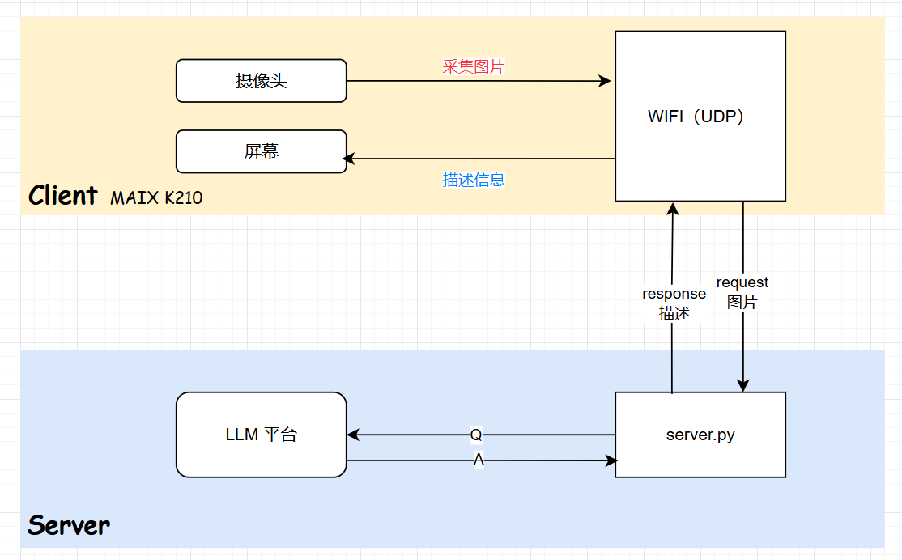


流程为：在设备中，从摄像头采集图片，连接WiFi，通过udp发送数据到服务端，服务端py脚本调用llm平台应用，获取图片描述信息，通过udp发送给设备，设备显示信息到屏幕。

下面一步步增加并验证功能。


## 5. LLM

### 1）创建应用

想通过应用来调用，发现应用图片参数不好传。只能用模型api直接调用（有图像处理的）


### 2）测试图片调用

```python
#coding=utf-8
import os
from openai import OpenAI

client = OpenAI(
    # 若没有配置环境变量，请用百炼API Key将下行替换为：api_key="sk-xxx",
    api_key="sk-xxx",
    base_url="https://dashscope.aliyuncs.com/compatible-mode/v1",
)
completion = client.chat.completions.create(
    model="qwen-vl-plus",  # 此处以qwen-vl-plus为例，可按需更换模型名称。模型列表：https://help.aliyun.com/zh/model-studio/getting-started/models
    messages=[
            {"role": "user","content": [
            {"type": "text","text": "你是一个图片助手，用户给你输入一张图片，你用简短的语言来描述图片的物体，以特殊词“bingo!”开头，不超过20个字。 如果没输入图片，你就说“主人，请输入图片”"},
            {"type": "image_url",
             "image_url": {"url": "https://dashscope.oss-cn-beijing.aliyuncs.com/images/dog_and_girl.jpeg"}}
            ]}]
    )
print(completion.model_dump_json())
```


```
{"id":"chatcmpl-297e3189-7387-9ed6-b3fd-90d5096a56e8","choices":[{"finish_reason":"stop","index":0,"logprobs":null,"message":{"content":"bingo! 女孩和狗在沙滩上互动，夕阳为背景。","refusal":null,"role":"assistant","annotations":null,"audio":null,"function_call":null,"tool_calls":null}}],"created":1742133824,"model":"qwen-vl-plus","object":"chat.completion","service_tier":null,"system_fingerprint":null,"usage":{"completion_tokens":19,"prompt_tokens":1323,"total_tokens":1342,"completion_tokens_details":null,"prompt_tokens_details":null}}
```


### 3）python静态图片服务

llm需要传入网络图片，需要先上传图片并获取地址

```python
import os
import uuid
from flask import Flask, request, jsonify

# 配置服务器
UPLOAD_FOLDER = "static/uploads"  # 图片存储目录
BASE_URL = "http://xx.xx.xx.xx:9001/"  # 服务器访问地址

# 创建目录（如果不存在）
os.makedirs(UPLOAD_FOLDER, exist_ok=True)

# 初始化 Flask
app = Flask(__name__)


@app.route("/upload", methods=["POST"])
def upload_image():
    """接收图片并存储到静态目录"""
    if "file" not in request.files:
        return jsonify({"error": "No file part"}), 400

    file = request.files["file"]

    if file.filename == "":
        return jsonify({"error": "No selected file"}), 400

    # 生成唯一文件名
    filename = f"{uuid.uuid4().hex}.jpg"
    file_path = os.path.join(UPLOAD_FOLDER, filename)
    
    # 保存图片
    file.save(file_path)

    # 返回访问 URL
    file_url = f"{BASE_URL}{file_path}"
    return jsonify({"url": file_url})


if __name__ == "__main__":
    app.run(host="0.0.0.0", port=9001, debug=True)

```


测试成功，http://xx.xx.xx.xx:9001/upload


### 4）服务端程序

使用tcp连接，接收图片（带协议），解析图片，上传图片，调用LLM获取结果，发送给客户端。


协议为：帧头（0XAB，0XCD），长度（4字节数据长度，小端），数据...，校验（1位异或）

### 5）客户端程序

嵌入式开个小节写


## 6. 嵌入式软件

### 1）wifi连接

wifi文件参考：

[ESP82XX 的 AT 固件](https://wiki.sipeed.com/soft/maixpy/zh/course/network/network_config.html#ESP82XX-的-AT-固件)，[network_espat.py](https://github.com/sipeed/MaixPy-v1_scripts/blob/master/network/network_espat.py)


```
# This file is part of MaixPY
# Copyright (c) sipeed.com
#
# Licensed under the MIT license:
#   http://www.opensource.org/licenses/mit-license.php
#

import time, network
from Maix import GPIO
from machine import UART
from fpioa_manager import fm
from board import board_info

class wifi():

    __is_m1w__ = True
    uart = None
    eb = None
    nic = None

    def init():
        if __class__.__is_m1w__:
            fm.register(0, fm.fpioa.GPIOHS1, force=True)
            M1wPower=GPIO(GPIO.GPIOHS1, GPIO.OUT)
            M1wPower.value(0) # b'\r\n ets Jan  8 2013,rst cause:1, boot mode:(7,6)\r\n\r\nwaiting for host\r\n'

        fm.register(board_info.WIFI_EN, fm.fpioa.GPIOHS0) # board_info.WIFI_EN == IO 8
        __class__.en = GPIO(GPIO.GPIOHS0,GPIO.OUT)

        fm.register(board_info.WIFI_RX,fm.fpioa.UART2_TX) # board_info.WIFI_RX == IO 7
        fm.register(board_info.WIFI_TX,fm.fpioa.UART2_RX) # board_info.WIFI_TX == IO 6
        __class__.uart = UART(UART.UART2, 115200, timeout=1000, read_buf_len=8192)

    def enable(en):
        __class__.en.value(en)

    def _at_cmd(cmd="AT\r\n", resp="OK\r\n", timeout=20):
        __class__.uart.write(cmd) # "AT+GMR\r\n"
        time.sleep_ms(timeout)
        tmp = __class__.uart.read()
        # print(tmp)
        if tmp and tmp.endswith(resp):
            return True
        return False

    def at_cmd(cmd="AT\r\n", timeout=20):
        __class__.uart.write(cmd) # "AT+GMR\r\n"
        time.sleep_ms(timeout)
        tmp = __class__.uart.read()
        return tmp

    def reset(force=False, reply=5):
        if force == False and __class__.isconnected():
            return True
        __class__.init()
        for i in range(reply):
            print('reset...')
            __class__.enable(False)
            time.sleep_ms(50)
            __class__.enable(True)
            time.sleep_ms(500) # at start > 500ms
            if __class__._at_cmd(timeout=500):
                break
        __class__._at_cmd()
        __class__._at_cmd('AT+UART_CUR=921600,8,1,0,0\r\n', "OK\r\n")
        __class__.uart = UART(UART.UART2, 921600, timeout=1000, read_buf_len=10240)
        # important! baudrate too low or read_buf_len too small will loose data
        #print(__class__._at_cmd())
        try:
            __class__.nic = network.ESP8285(__class__.uart)
            time.sleep_ms(500) # wait at ready to connect
        except Exception as e:
            print(e)
            return False
        return True

    def connect(ssid="wifi_name", pasw="pass_word"):
        if __class__.nic != None:
            return __class__.nic.connect(ssid, pasw)

    def ifconfig(): # should check ip != 0.0.0.0
        if __class__.nic != None:
            return __class__.nic.ifconfig()

    def isconnected():
        if __class__.nic != None:
            return __class__.nic.isconnected()
        return False

if __name__ == "__main__":
    # It is recommended to callas a class library (upload network_espat.py) 

    # from network_espat import wifi
    SSID = "Sipeed_2.4G"
    PASW = "xxxxxxxx"

    def check_wifi_net(reply=5):
        if wifi.isconnected() != True:
            for i in range(reply):
                try:
                    wifi.reset()
                    print('try AT connect wifi...', wifi._at_cmd())
                    wifi.connect(SSID, PASW)
                    if wifi.isconnected():
                        break
                except Exception as e:
                    print(e)
        return wifi.isconnected()

    if wifi.isconnected() == False:
        check_wifi_net()
    print('network state:', wifi.isconnected(), wifi.ifconfig())

    # The network is no longer configured repeatedly
    import socket
    sock = socket.socket()
    # your send or recv
    # see other demo_socket_tcp.py / udp / http / mqtt
    sock.close()

'''ouput
    >>>
    raw REPL; CTRL-B to exit
    >OK
    [Warning] function is used by fm.fpioa.GPIOHS1(pin:17)
    [Warning] function is used by fm.fpioa.GPIOHS0(pin:16)
    reset...
    try AT connect wifi... True
    could not connect to ssid=Sipeed_2.4G
    reset...
    try AT connect wifi... True
    network state: True ('192.168.0.165', '255.255.255.0', '192.168.0.1', '0', '0', 'b0:b9:8a:5b:be:7f', 'Sipeed_2.4G')
    >
    MicroPython v0.5.1-136-g039f72b6c-dirty on 2020-11-18; Sipeed_M1 with kendryte-k210
    Type "help()" for more information.
    >>>
    >>>
    >>>
    raw REPL; CTRL-B to exit
    >OK
    network state: True ('192.168.0.165', '255.255.255.0', '192.168.0.1', '0', '0', 'b0:b9:8a:5b:be:7f', 'Sipeed_2.4G')
    >
'''

```


### 2）使用网络

参考：[如何使用 Socket 网络编程](https://wiki.sipeed.com/soft/maixpy/zh/course/network/socket_usage.html)，

wifi连接后就有了网络能力，开始tcp连接

```python
# This file is part of MaixPY
# Copyright (c) sipeed.com
#
# Licensed under the MIT license:
#   http://www.opensource.org/licenses/mit-license.php
#

#network_wiznet5k()

SSID = "XM-AE86"
PASW = "xxxxxx"

import time, network
from Maix import GPIO
from machine import UART
from fpioa_manager import fm
from board import board_info

class wifi():

    __is_m1w__ = True
    uart = None
    eb = None
    nic = None

    def init():
        if __class__.__is_m1w__:
            fm.register(0, fm.fpioa.GPIOHS1, force=True)
            M1wPower=GPIO(GPIO.GPIOHS1, GPIO.OUT)
            M1wPower.value(0) # b'\r\n ets Jan  8 2013,rst cause:1, boot mode:(7,6)\r\n\r\nwaiting for host\r\n'

        fm.register(board_info.WIFI_EN, fm.fpioa.GPIOHS0) # board_info.WIFI_EN == IO 8
        __class__.en = GPIO(GPIO.GPIOHS0,GPIO.OUT)

        fm.register(board_info.WIFI_RX,fm.fpioa.UART2_TX) # board_info.WIFI_RX == IO 7
        fm.register(board_info.WIFI_TX,fm.fpioa.UART2_RX) # board_info.WIFI_TX == IO 6
        __class__.uart = UART(UART.UART2, 115200, timeout=1000, read_buf_len=8192)

    def enable(en):
        __class__.en.value(en)

    def _at_cmd(cmd="AT\r\n", resp="OK\r\n", timeout=20):
        __class__.uart.write(cmd) # "AT+GMR\r\n"
        time.sleep_ms(timeout)
        tmp = __class__.uart.read()
        # print(tmp)
        if tmp and tmp.endswith(resp):
            return True
        return False

    def at_cmd(cmd="AT\r\n", timeout=20):
        __class__.uart.write(cmd) # "AT+GMR\r\n"
        time.sleep_ms(timeout)
        tmp = __class__.uart.read()
        return tmp

    def reset(force=False, reply=5):
        if force == False and __class__.isconnected():
            return True
        __class__.init()
        for i in range(reply):
            print('reset...')
            __class__.enable(False)
            time.sleep_ms(50)
            __class__.enable(True)
            time.sleep_ms(500) # at start > 500ms
            if __class__._at_cmd(timeout=500):
                break
        __class__._at_cmd()
        __class__._at_cmd('AT+UART_CUR=921600,8,1,0,0\r\n', "OK\r\n")
        __class__.uart = UART(UART.UART2, 921600, timeout=1000, read_buf_len=10240)
        # important! baudrate too low or read_buf_len too small will loose data
        #print(__class__._at_cmd())
        try:
            __class__.nic = network.ESP8285(__class__.uart)
            time.sleep_ms(500) # wait at ready to connect
        except Exception as e:
            print(e)
            return False
        return True

    def connect(ssid="wifi_name", pasw="pass_word"):
        if __class__.nic != None:
            return __class__.nic.connect(ssid, pasw)

    def ifconfig(): # should check ip != 0.0.0.0
        if __class__.nic != None:
            return __class__.nic.ifconfig()

    def isconnected():
        if __class__.nic != None:
            return __class__.nic.isconnected()
        return False

def enable_espat():
    if wifi.isconnected() == False:
        for i in range(5):
            try:
                # Running within 3 seconds of power-up can cause an SD load error
                # wifi.reset(is_hard=False)
                wifi.reset()
                print('try AT connect wifi...')
                wifi.connect(SSID, PASW)
                if wifi.isconnected():
                    break
            except Exception as e:
                print(e)
    print('network state:', wifi.isconnected(), wifi.ifconfig())

#enable_espat()

def check_wifi_net(reply=5):
    if wifi.isconnected() != True:
        for i in range(reply):
            try:
                wifi.reset()
                print('try AT connect wifi...', wifi._at_cmd())
                wifi.connect(SSID, PASW)
                if wifi.isconnected():
                    break
            except Exception as e:
                print(e)
    return wifi.isconnected()

if wifi.isconnected() == False:
    check_wifi_net()
print('network state:', wifi.isconnected(), wifi.ifconfig())


import socket

ADDR = ("xx.xx.xx.xx", 60000)

sock = socket.socket()
sock.connect(ADDR)

sock.settimeout(1)
while 1:
    sock.send("hello\n")
    #data = sock.recv(10) # old maxipy have bug (recv timeout no return last data)
    #print(data) # fix
    try:
      data = b""
      while True:
        tmp = sock.recv(1)
        print(tmp)
        if len(tmp) == 0:
            raise Exception('timeout or disconnected')
        data += tmp
    except Exception as e:
      print("rcv:", len(data), data)
    #time.sleep(2)

sock.close()
```


### 3）屏幕

**参考**

[lcd 屏幕显示驱动](http://www.86x.org/cn-maixpy/cn.maixpy.sipeed.com/zh/api_reference/machine_vision/lcd.html)，lcd库函数列表

[库函数-image（机器视觉）](https://wiki.sipeed.com/soft/maixpy/zh/api_reference/machine_vision/image/image.html)

[如何在图像上写字](https://wiki.sipeed.com/soft/maixpy/zh/course/image/basic/draw.html)

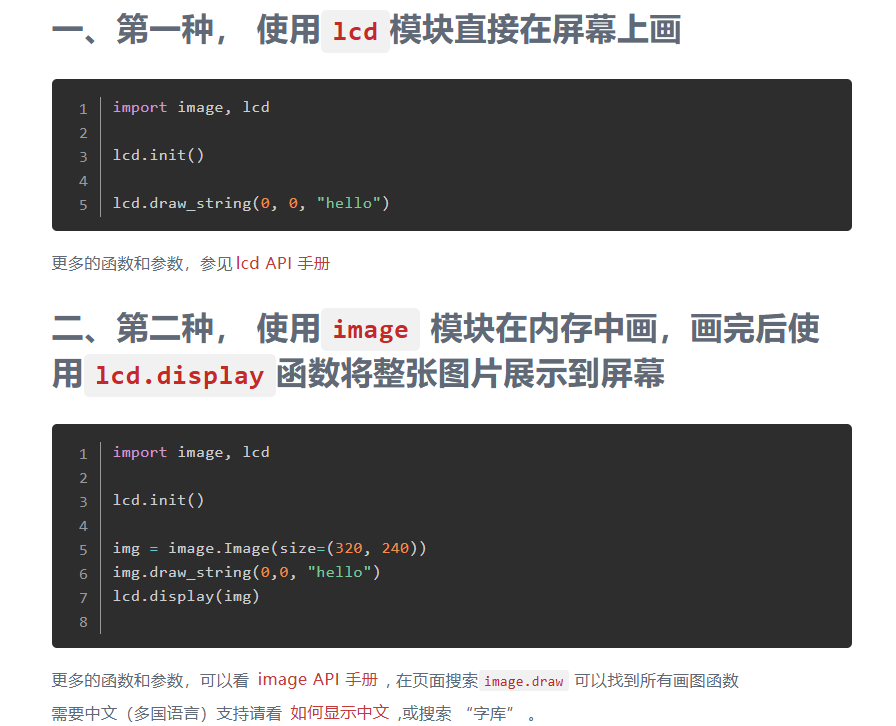

[GUI支持-如何显示中文](https://wiki.sipeed.com/soft/maixpy/zh/course/image/image_draw_font/image_draw_font.html)

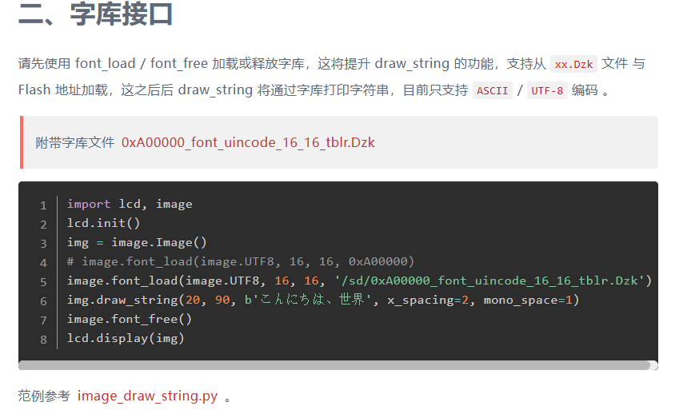


综上，使用方法：

想要有汉字，需要使用字库文件（2MB），板载flash只剩余了3MB，还是放到sd卡上。

sd卡使用：将SD卡格式化为FAT32格式，将字库文件放到根目录；板子断电，插上sd卡后上电，即可使用sd卡上的文件。


代码如下，用的基本例程（显示摄像头采集的画面到lcd上，加中文注释的两句代码是新增

```python
# Hello World Example
#
# Welcome to the MaixPy IDE!
# 1. Conenct board to computer
# 2. Select board at the top of MaixPy IDE: `tools->Select Board`
# 3. Click the connect buttion below to connect board
# 4. Click on the green run arrow button below to run the script!

import sensor, image, time, lcd

lcd.init(freq=15000000)
sensor.reset()                      # Reset and initialize the sensor. It will
                                    # run automatically, call sensor.run(0) to stop
sensor.set_pixformat(sensor.RGB565) # Set pixel format to RGB565 (or GRAYSCALE)
sensor.set_framesize(sensor.QVGA)   # Set frame size to QVGA (320x240)
sensor.skip_frames(time = 2000)     # Wait for settings take effect.
clock = time.clock()                # Create a clock object to track the FPS.

# 导入字库
image.font_load(image.UTF8, 16, 16, '/sd/0xA00000_font_uincode_16_16_tblr.Dzk')


while(True):
    clock.tick()                    # Update the FPS clock.
    img = sensor.snapshot()         # Take a picture and return the image.
    # 图片上加文字
    img.draw_string(100,100, "你好", x_spacing=2, mono_space=1, color=(0,128,0), scale=2)
    lcd.display(img)                # Display on LCD
    print(clock.fps())              # Note: MaixPy's Cam runs about half as fast when connected
                                    # to the IDE. The FPS should increase once disconnected.

```


### 4）图像处理

需要将图片处理为jpg格式的字节数组

参考： [基本图像变换 和 常用操作](https://wiki.sipeed.com/soft/maixpy/zh/course/image/basic/vary.html)


```python
# 原图压缩jpeg，转字节
img2 = img.compressed(quality=20)
jpeg_bytes = img2.to_bytes()
print("bytes length: %d bytes[0]: %x%x" %(len(jpeg_bytes), jpeg_bytes[0], jpeg_bytes[1]))
```

输出"ffd8"，为jpeg格式头。


## 7. 代码

服务器端

server.py  开启tcp服务器，处理图片协议，调用LLM，返回结果

```
# coding=utf-8
import socket
import base64
import json
import os
import requests
from openai import OpenAI
import struct

# 配置 LLM API
API_KEY = "sk-xxx"  # 请替换为你的 DashScope API Key
BASE_URL = "https://dashscope.aliyuncs.com/compatible-mode/v1"
MODEL_NAME = "qwen-vl-plus"  # 选择的 LLM 模型

# TCP 服务器配置
HOST = "0.0.0.0"
PORT = 9002
BUFFER_SIZE = 1024 * 1024  # 1MB 缓冲区

# Flask 服务器上传 API
UPLOAD_URL = "http://39.103.59.12:9001/upload"


# 初始化 OpenAI 客户端
client = OpenAI(api_key=API_KEY, base_url=BASE_URL)

def upload_image(image_data):
    """上传图片到 Flask 服务器"""
    files = {"file": ("image.jpg", image_data, "image/jpeg")}
    response = requests.post(UPLOAD_URL, files=files)

    if response.status_code == 200:
        return response.json().get("url")
    else:
        print("图片上传失败:", response.text)
        return None


def call_llm(image_url):
    """调用 LLM 处理图片"""
    try:
        completion = client.chat.completions.create(
            model=MODEL_NAME,
            messages=[
                {
                    "role": "user",
                    "content": [
                        {"type": "text", "text": "你是一个图片助手，用户给你输入一张图片，你用简短的语言来描述图片的物体，以特殊词“bingo!”开头，除特殊词外不能超过10个字，内容中不需要出现“图中”等字眼，只描述物体就行，比如“一个苹果”。 如果没输入图片，你就说“主人，请输入图片”"},
                        {"type": "image_url", "image_url": {"url":image_url}}
                    ]
                }
            ]
        )
        # 解析 LLM 响应
        response_data = json.loads(completion.model_dump_json())
        text_result = response_data.get("choices", [{}])[0].get("message", {}).get("content", "LLM 解析失败")
        return text_result
    except Exception as e:
        return f"LLM 调用失败: {str(e)}"

def xor_checksum(data):
    """计算 XOR 校验"""
    checksum = 0
    for byte in data:
        checksum ^= byte
    return checksum

def handle_client(conn, addr):
    """处理 TCP 连接"""
    print(f"连接来自: {addr}")

    try:
        # 超时断开
        conn.settimeout(5)
        
        # 解析协议：帧头（0XAB，0XCD），长度（4字节数据长度，小端），数据...，校验（1位异或）
        # 帧头 AB CD
        header = conn.recv(2)
        if header!=b'\xAB\xCD':
            print("协议解析：帧头错误")
            conn.sendall(b"ERROR: Invaild header")
            return
        # 长度
        data_len_bs = conn.recv(4)
        if not data_len_bs:
            print("协议解析：长度错误")
            conn.sendall(b"ERROR: Invaild len")
            return
        data_len = struct.unpack("<I", data_len_bs)[0]
        if data_len < 1:
            print("协议解析：数据为空")
            conn.sendall(b"ERROR: Empty data")
            return
        print(f"接收数据长度: {data_len} 字节")
        # 数据
        data = b""
        while len(data) < data_len:
            chunk = conn.recv(min(BUFFER_SIZE, data_len-len(data)))
            if not chunk:
                break  # 连接关闭，停止接收
            data+=chunk
        if len(data) != data_len:
            print("协议解析：数据不完整")
            conn.sendall(b"ERROR: Incomplete data")
            return
        # 校验
        check_byte = conn.recv(1)
        check = struct.unpack("<B", check_byte)[0]
        if xor_checksum(data)!=check:
            print("协议解析：校验失败 {} {}".format(xor_checksum(data), check))
            conn.sendall(b"ERROR: Check mismatch")
            return
        
        # 上传图片
        print("upload image")
        image_url = upload_image(data)
        if not image_url:
            conn.sendall(b"ERROR: Image upload failed")
            return

        print("图片 URL:", image_url)

        # 调用 LLM
        llm_result = call_llm(image_url)
        print("LLM 结果:", llm_result)

        # 返回结果
        conn.sendall(llm_result.encode())
    except socket.timeout:
        # 超时断开
        print("conn timeout")
        conn.sendall(b"ERROR: timeout")
    except Exception as e:
        print("处理失败:", e)
        conn.sendall(b"ERROR: Server error")
    finally:
        conn.close()


def start_server():
    """启动 TCP 服务器"""
    with socket.socket(socket.AF_INET, socket.SOCK_STREAM) as server:
        server.bind((HOST, PORT))
        server.listen(5)
        print(f"TCP 服务器已启动，监听端口 {PORT}...")

        while True:
            conn, addr = server.accept()
            conn.settimeout(5)
            print(f"连接来自: {addr}")
            handle_client(conn,addr)


if __name__ == "__main__":
    start_server()


```


static.py 静态图片服务,上传和访问图片

```
import os
import uuid
from flask import Flask, request, jsonify

# 配置服务器
UPLOAD_FOLDER = "static/uploads"  # 图片存储目录
BASE_URL = "http://127.0.0.1:9001/"  # 服务器访问地址

# 创建目录（如果不存在）
os.makedirs(UPLOAD_FOLDER, exist_ok=True)

# 初始化 Flask
app = Flask(__name__)


@app.route("/upload", methods=["POST"])
def upload_image():
    """接收图片并存储到静态目录"""
    if "file" not in request.files:
        return jsonify({"error": "No file part"}), 400

    file = request.files["file"]

    if file.filename == "":
        return jsonify({"error": "No selected file"}), 400

    # 生成唯一文件名
    filename = f"{uuid.uuid4().hex}.jpg"
    file_path = os.path.join(UPLOAD_FOLDER, filename)
    
    # 保存图片
    file.save(file_path)

    # 返回访问 URL
    file_url = f"{BASE_URL}{file_path}"
    return jsonify({"url": file_url})


if __name__ == "__main__":
    app.run(host="0.0.0.0", port=5000, debug=True)

```


嵌入式：

```
# coding=utf-8
# This file is part of MaixPY
# Copyright (c) sipeed.com
#
# Licensed under the MIT license:
#   http://www.opensource.org/licenses/mit-license.php
#


SSID = "XM-AE86"
PASW = "xxxxx"

import time, network
from Maix import GPIO
from machine import UART
from fpioa_manager import fm
from board import board_info
from sys import exit
import socket
import sensor, image, lcd
import struct


class wifi():

    __is_m1w__ = True
    uart = None
    eb = None
    nic = None

    def init():
        if __class__.__is_m1w__:
            fm.register(0, fm.fpioa.GPIOHS1, force=True)
            M1wPower=GPIO(GPIO.GPIOHS1, GPIO.OUT)
            M1wPower.value(0) # b'\r\n ets Jan  8 2013,rst cause:1, boot mode:(7,6)\r\n\r\nwaiting for host\r\n'

        fm.register(board_info.WIFI_EN, fm.fpioa.GPIOHS0) # board_info.WIFI_EN == IO 8
        __class__.en = GPIO(GPIO.GPIOHS0,GPIO.OUT)

        fm.register(board_info.WIFI_RX,fm.fpioa.UART2_TX) # board_info.WIFI_RX == IO 7
        fm.register(board_info.WIFI_TX,fm.fpioa.UART2_RX) # board_info.WIFI_TX == IO 6
        __class__.uart = UART(UART.UART2, 115200, timeout=1000, read_buf_len=8192)

    def enable(en):
        __class__.en.value(en)

    def _at_cmd(cmd="AT\r\n", resp="OK\r\n", timeout=20):
        __class__.uart.write(cmd) # "AT+GMR\r\n"
        time.sleep_ms(timeout)
        tmp = __class__.uart.read()
        # print(tmp)
        if tmp and tmp.endswith(resp):
            return True
        return False

    def at_cmd(cmd="AT\r\n", timeout=20):
        __class__.uart.write(cmd) # "AT+GMR\r\n"
        time.sleep_ms(timeout)
        tmp = __class__.uart.read()
        return tmp

    def reset(force=False, reply=5):
        if force == False and __class__.isconnected():
            return True
        __class__.init()
        for i in range(reply):
            print('reset...')
            __class__.enable(False)
            time.sleep_ms(50)
            __class__.enable(True)
            time.sleep_ms(500) # at start > 500ms
            if __class__._at_cmd(timeout=500):
                break
        __class__._at_cmd()
        __class__._at_cmd('AT+UART_CUR=921600,8,1,0,0\r\n', "OK\r\n")
        __class__.uart = UART(UART.UART2, 921600, timeout=1000, read_buf_len=10240)
        # important! baudrate too low or read_buf_len too small will loose data
        #print(__class__._at_cmd())
        try:
            __class__.nic = network.ESP8285(__class__.uart)
            time.sleep_ms(500) # wait at ready to connect
        except Exception as e:
            print(e)
            return False
        return True

    def connect(ssid="wifi_name", pasw="pass_word"):
        if __class__.nic != None:
            return __class__.nic.connect(ssid, pasw)

    def ifconfig(): # should check ip != 0.0.0.0
        if __class__.nic != None:
            return __class__.nic.ifconfig()

    def isconnected():
        if __class__.nic != None:
            return __class__.nic.isconnected()
        return False

# 连接wifi
def enable_espat(reply=5):
    if wifi.isconnected() != True:
        for i in range(reply):
            try:
                wifi.reset()
                print('try AT connect wifi...', wifi._at_cmd())
                wifi.connect(SSID, PASW)
                if wifi.isconnected():
                    break
            except Exception as e:
                print(e)
    return wifi.isconnected()

def xor_checksum(data):
    """计算 XOR 校验"""
    checksum = 0
    for byte in data:
        checksum ^= byte
    return checksum

# 发送图片
ADDR = ("39.103.59.12", 9002)
def send_image(image_data):
    '''
    with open(image_path, "rb") as f:
        image_data = f.read()
    '''

    img_size = len(image_data)
    print("发送图片大小: {} 字节".format(img_size))

    client = socket.socket()
    client.connect(ADDR)

    client.settimeout(1)

    # 发送帧头
    client.send(b"\xAB\xCD")
    # 发送 4 字节的大小
    client.send(struct.pack("<I", img_size))
    # 发送图片数据
    client.send(image_data)
    # 校验
    cs = xor_checksum(image_data)
    print("checksum=", cs)
    client.send(struct.pack("<B", cs))

    # 等待服务器返回 LLM 结果
    response = client.recv(1024)
    llm_result = response.decode()
    print("LLM 结果:", llm_result)

    if llm_result.startswith("bingo!"):
        return llm_result[7:]
    return ""

# lcd init
def lcd_init():

    lcd.init(freq=15000000)
    sensor.reset()                      # Reset and initialize the sensor. It will
                                        # run automatically, call sensor.run(0) to stop
    sensor.set_pixformat(sensor.RGB565) # Set pixel format to RGB565 (or GRAYSCALE)
    sensor.set_framesize(sensor.QVGA)   # Set frame size to QVGA (320x240)
    sensor.skip_frames(time = 2000)     # Wait for settings take effect.

    # 导入字库
    image.font_load(image.UTF8, 16, 16, '/sd/0xA00000_font_uincode_16_16_tblr.Dzk')


if __name__ == "__main__":
    # 连接wifi
    if enable_espat(3) == False:
        print("ERROR: wifi连接失败·")
        exit()
    else:
        print("连接成功")
        print('network state:', wifi.isconnected(), wifi.ifconfig())

    print("连接成功2")

    # 视频和lcd初始化
    lcd_init()
    clock = time.clock()                # Create a clock object to track the FPS.

    tim = time.time()
    llm_desc = ""
    while(True):
        try:
            clock.tick()                    # Update the FPS clock.
            img = sensor.snapshot()         # Take a picture and return the image.

            # 每2秒取一次图片
            if time.time() -tim >2:
                tim = time.time()

                # 原图压缩jpeg，转字节
                img2 = img.compressed(quality=20)
                jpeg_bytes = img2.to_bytes()
                print("bytes length: %d bytes[0]: %x%x" %(len(jpeg_bytes), jpeg_bytes[0], jpeg_bytes[1]))

                # 发送图片获取描述信息
                llm_desc = send_image(jpeg_bytes)

            # 图片上加文字显示到lcd
            img.draw_string(20,100, llm_desc, x_spacing=2, mono_space=1, color=(255,0,0), scale=2)

            lcd.display(img)                # Display on LCD
            print(clock.fps())              # Note: MaixPy's Cam runs about half as fast when connected

        except Exception as e:
            print(e)

```


结项。撒花。